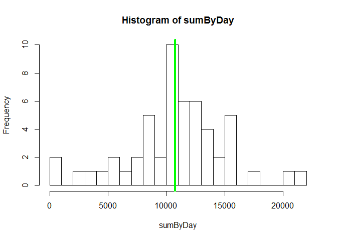
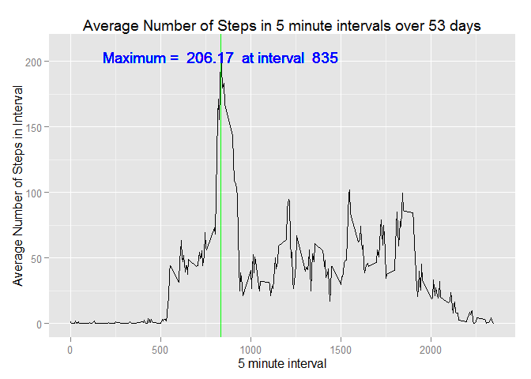
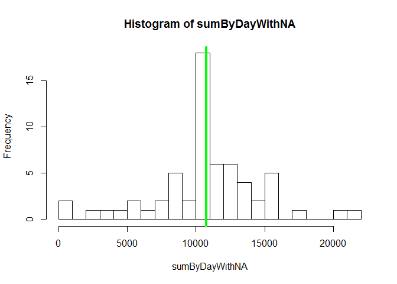

# Reproducible Research: Peer Assessment 1


## Loading and preprocessing the data
 # Loading: Step 1. First, load the activity.csv file and get the ggplot library

```r
activity_data <- read.csv(".\\activity.csv",header = TRUE, stringsAsFactors = FALSE ) 
library(ggplot2)
```

```
## Warning: package 'ggplot2' was built under R version 3.1.3
```
Look at the first few items, note that the steps column has some NA

```r
head(activity_data)
```

```
##   steps       date interval
## 1    NA 2012-10-01        0
## 2    NA 2012-10-01        5
## 3    NA 2012-10-01       10
## 4    NA 2012-10-01       15
## 5    NA 2012-10-01       20
## 6    NA 2012-10-01       25
```
Loading: Step 2. Transform the data into a suitable format. 
Let's get only the complete rows there are no NAs. We'll use only the complete rows to do the first few analyses. 

```r
complete_ad <-activity_data[complete.cases(activity_data),]
head(complete_ad)
```

```
##     steps       date interval
## 289     0 2012-10-02        0
## 290     0 2012-10-02        5
## 291     0 2012-10-02       10
## 292     0 2012-10-02       15
## 293     0 2012-10-02       20
## 294     0 2012-10-02       25
```

One interesting number is how many 5 minute intervals there are in a day, so let's compute that, and then also the number of days for which we have data, and the number of days for which we have complete data. 


```r
num5MinsInDay <- 24*12

nDays <- nrow(activity_data)/num5Mins

nDaysComplete <- nrow(complete_ad)/num5Mins
size_dif <- nDays-nDaysComplete
```
Note that there are 15264 rows in the complete set compared to 17568 in the original set, so we lost   8 days  of data. When we do all of averages and such, for this first part of the report, we will ignore the missing data and simply use the data for the existing 53 days. 

## What is mean total number of steps taken per day?

First we have to sum the steps by day. To do this, we first split activity_data by date, and then sum across the split to get the total number of steps per day. 


```r
splitComplete = split(complete_ad$steps,complete_ad$date)
sumByDay <- sapply(splitComplete, sum)

meanTotalSteps <- mean(sumByDay)
medianTotalSteps <- median(sumByDay)
hist(sumByDay, breaks = 20)
abline(v=meanTotalSteps, col="blue",lwd = 4)
abline(v=medianTotalSteps, col = "green", lwd = 4)
```

 

The mean total steps is 10766.19 and the median total steps is 10765. Although they are drawn in different colors on the graph, they are so close, that you can't see the difference on this scale.

## What is the average daily activity pattern?
Now we want to look at each 5 minute interval across all days and calculate the the average number of steps taken. For example, we will average the number of steps takden during the 3rd 5 minute interval of each day across all days. Since the 5 minute intervals recycle every day, we can simply split the data using the interval column. Then calculate the desired statistics across each interval. 

```r
splitCompleteInterval = split(complete_ad$steps,complete_ad$interval)
sumByInterval <- sapply(splitCompleteInterval, sum)
```
Let's make sure that there are the same number of 5 minute intervals for all of the days, so the averaging is simply dividing by the number of days that we calculated previously.

```r
areAllSameLength <- sapply(splitCompleteInterval, function(x) length(x)==nDaysComplete)
```
Just as a reminder, there are 288 5 minute intervals in one day. So all 288 5 minute intervals have 53 datapoints, so we don't have any partial days. To get the average per day we can simply divide  sumByInterval values by 53.  

```r
averagePer5MinInterval <- sumByInterval/nDaysComplete
```

Put the data into a data frame to make a  graph with x-axis being the index of the 5 minute interval and the y-axis being the average umber of steps taken, averaged across all days.Rememer that the 5 minute interval counts just recycle every day, so for one day, we just use the unique function to get the x-axis values.

```r
df <- data.frame(unique(complete_ad$interval),y=averagePer5MinInterval)
g <- ggplot(df, aes(x=unique(complete_ad$interval),y=y))
gg <- g+geom_line() 
```

Which 5-minute, on average across all the days in the data set contains the maximum number of steps?

There are a number of ways to do this. Order "averagePer5MinInterval" from greatest to least and then simply select the first value. That will give us the index of the maximum number of steps. The  max value is found by looking at the index in averagePer5MinInteral. The particular 5-minute interval is found by finding the name of the row for the maximum value. Once these are all calculated, they can be added to the plot, and plotted.

```r
indexOfMax <- order(averagePer5MinInterval, decreasing=TRUE)[1]
maxValue <- format(round(averagePer5MinInterval[indexOfMax],2))
intervalForMax <- unique(complete_ad$interval)[indexOfMax]
annotMax <-paste( "Maximum = ",maxValue, " at interval ", format(round(intervalForMax,2)))
gline <- gg + geom_vline(xintercept = intervalForMax,col="green") 
gg2 <- gline + geom_text(aes(x= intervalForMax, label=annotMax, y=210), colour="blue", vjust = 1.2) 
ggdone <- gg2 +  labs(x="5 minute interval") + labs(y="Average Number of Steps in Interval") + labs(title="Average Number of Steps in 5 minute intervals over 53 days")
ggdone
```

 

## Imputing missing values
Calculate the total number of missing values in the dataset. 
The total number of missing values in the dataset was calculated earlier, by subtracting the size of the dataset without the NAs from the size of the dataset with the NAs. 
Number of missing values: 8

To impute missing values, start with the original data and split the data by date. Then we'll replace the missing interval data with the average value for that interval that we calculated previously - 

```r
splitAll <- split(activity_data$steps,activity_data$date)
whichAreNA <- sapply(splitAll, function(x) length(which(is.na(x))>0))
fillInThese <- names(which(whichAreNA>0))
```
Now I have the 8 days that need to be filled in. So I'll go back to the split data and fill in the missing data using the average 5 minute interval data that was calculated previously in averagePer5MinInterval and redo the statistics. By using the average steps in a 5 minute interval, the number of steps will no longer be guaranteed to be an integer. Thus the median may no longer be an integer.


```r
for( i in fillInThese) {
      
splitAll[[i]]<- averagePer5MinInterval
}

sumByDayWithNA <- sapply(splitAll, sum)
meanTotalStepsWithNA <- mean(sumByDayWithNA)
medianTotalStepsWithNA <- median(sumByDayWithNA)
hist(sumByDayWithNA, breaks = 20)
abline(v=meanTotalSteps, col="blue",lwd = 4)
abline(v=medianTotalSteps, col = "green", lwd = 4)
```

 

The mean total steps in this case is 10766.19 compared to the previous value of  10766.19 and the median total steps is 10766.19 compared to the previous value of 10765. So the median changed slightly (and is no longer an integer, as noted), but the mean did not. Once again, they are drawn in different colors on the graph, but they are so close, that you can't see the difference on this scale. In this case, a few NAs didn't really seem to make a difference.

## Are there differences in activity patterns between weekdays and weekends?

To determine if there are differences in activity patterns between weekdays and weekends, we'll add a factor column called "wday" with levels "weekday" and "weekend" to the complete cases dataset (complete_ad). Then we'll use that column as a facet to plot the aerage daily values for weekends and weekdays.Start by making the date column an actual date class, and then add the new factor variable. We'll use a little trick related to the fact that the integer value of FALSE evaluates to 0 and TRUE evaluates to 1. A boolean test of whether a day is a weekday will evaluate to FALSE if it is not and TRUE if it is. If 1 is added to these results, you will get 1 for a weekend and 2 for a weekday. The properly structured factor variable with these levels can then be used to fill in the column.


```r
complete_ad$date <- (as.Date(complete_ad$date))
weekdaysVec <- c("Monday","Tuesday","Wednesday","Thursday","Friday")
weekDayFactor <- factor(c("weekend","weekday"), levels = c("weekend","weekday"))
complete_ad$wday <- factor(levels(weekDayFactor)[(weekdays(complete_ad$date) %in% weekdaysVec +1)])
```
Now all that needs to be done is to repeat the same steps as before, only splitting the data by weekend and weekday.

```r
weekendData <- complete_ad[complete_ad$wday==weekDayFactor[1],]
nDaysweekend <- nrow(weekendData)/num5Mins
splitWeekendInterval = split(weekendData$steps,weekendData$interval)
sumByweekendInterval <- sapply(splitWeekendInterval, sum)
averagePer5MinIntervalWE <- sumByweekendInterval/nDaysweekend


weekdayData <- complete_ad[complete_ad$wday==weekDayFactor[2],]
 nDaysweekday<- nrow(weekdayData)/num5Mins
splitWeekdayInterval = split(weekdayData$steps,weekdayData$interval)
sumByweekdayInterval <- sapply(splitWeekdayInterval, sum)
averagePer5MinIntervalWD <- sumByweekdayInterval/nDaysweekday
```
Finally, assemble the data into a dataframe. First, add the correct factor variable, then rbind the two data sets together so we can use the factor as the facet in the plot. 

```r
dfweekend<- data.frame(interval = unique(weekendData$interval),steps=averagePer5MinIntervalWE)
dfweekend$wday <- factor(levels(weekDayFactor)[1])

dfweekday <- data.frame(interval = unique(weekendData$interval),steps=averagePer5MinIntervalWD)
dfweekday$wday <- factor(levels(weekDayFactor)[2])

dfWeWd <- rbind(dfweekend, dfweekday)

g <- ggplot(dfWeWd, aes(x=interval,y=steps))
gg <- g+geom_line() +facet_grid( wday ~ .)
g2 <-gg+ labs(y="Avg Num Steps in Interval")
g3 <- g2 + labs(title="Avg Num Steps in 5 min intervals (ingore NAs): weekends & weekdays")
 g3
```

 

From the graph we can conclude that there is overall more consistent activity on the weekends. However, itlooks like there is also some consistent high activity in the 500 to roughly 900 interval every weekday.
